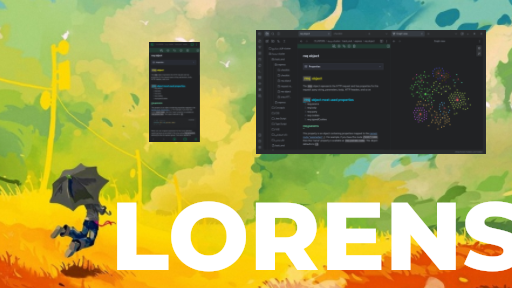
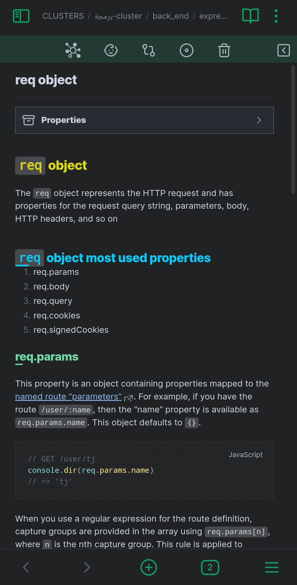

# LORENS OBSIDIAN THEME



---


Press `Install and use` button then watch the examples below :

# Example 1 
First header does'n have under line.
## Header 2

### header 3

#### header 4

---
# `Example` 2
## This `code` example

### `req`.body

Contains key-value pairs of data submitted in the request body. By default, it is `undefined`, and is populated when you use body-parsing middleware such as `express.json()` 

```javascript
var express = require('express')

var app = express()
app.post('/profile', function (req, res, next) {
  console.log(req.body)
  res.json(req.body)
})
```
---

#### Example 3

**Bullets:**
- [I] idea
- [*] the new ubuntu
- [l] Istanbul
- [p] like 
- [c] dislike
- [u] up
- [d] down

**Checks:**
- [ ] read book
- [x] go to park


*italic text here*

>[!bug] out-of-the-box idea here

>wisdom
>more  wisdom
>more more wisdom

- ["] even more wisdom


## Screenshots





---

Check my another plugin at : [Cluster cool plugin](https://github.com/lorens-osman-dev/cluster)

---
If you like this theme, feel free to support the development by buying a coffee:

## <a href="https://www.buymeacoffee.com/lorens" target="_blank"></a>

### Credits

Thank you for everyone in the Obsidian community that have contributed to testing and bug reporting.

Some of our inspiration came from the following project
https://github.com/Akifyss/obsidian-border